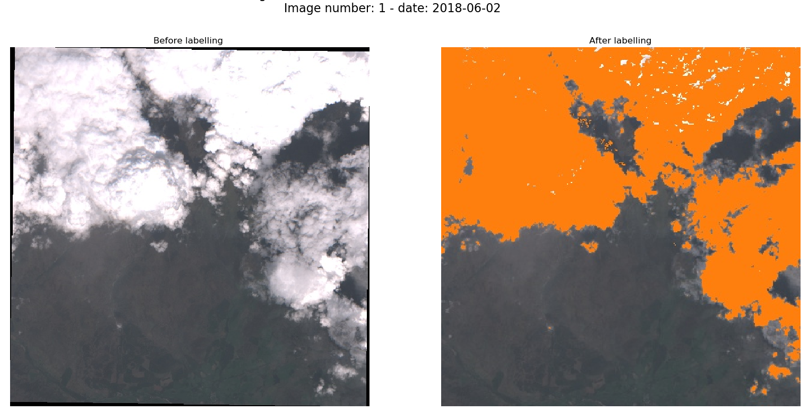
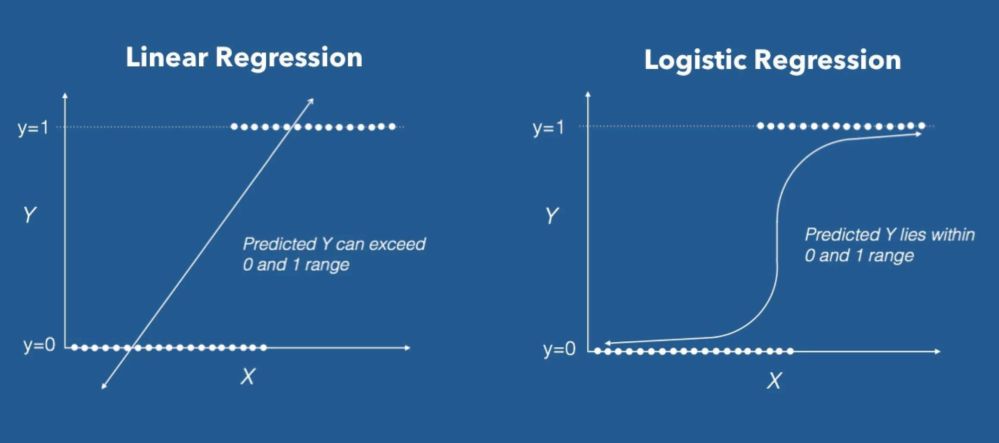

**About me**

Welcome to my report. I'm Alexandre Bort, a french student from ISIMA engineering school. I'm currently attending an internship at the James Hutton Institute (Scotland). This final EDX project is a great opportunity to apply the content of EDX lessons on my real data. 
Hope you will enjoy reading it!


```{r setup, include=FALSE}
knitr::opts_chunk$set(echo = TRUE)
load("processed_work_space.RData")
data <- data_init
library(ggplot2)
library(corrplot)      # Draw correlation plot
library(rpart.plot)
```

<style type="text/css">

body{ /* Normal  */
    font-size: 12px;
}
td {  /* Table  */
  font-size: 8px;
}
h1.title {
  font-size: 38px;
  color: DarkRed;
}
h1 { /* Header 1 */
  font-size: 28px;
  color: DarkBlue;
}
h2 { /* Header 2 */
    font-size: 22px;
  color: DarkBlue;
}
h3 { /* Header 3 */
  font-size: 18px;
  font-family: "Times New Roman", Times, serif;
  color: DarkBlue;
}
code.r{ /* Code block */
    font-size: 12px;
}
pre { /* Code block - determines code spacing between lines */
    font-size: 14px;
}
</style>

---

## Plan of the study
    I. Introduction
    II. Methods - Analysis 
        1. Dataset
        2. Pre-processing
            a. Remove worthless columns
            b. Transform `cloud` column
            c. Remove invalid pixels
            d. Distribution - correlation
        3. Models
    III. Results
        1. Logistic model
        2. Decision tree
        3. Random Forest
    IV. Conclusion


# I. Introduction

The last decades, satellite missions has increased with the development of new technologies. The data gathered by the different missions has grown very fast. Today, it's quite easy to access all this data. Main providers as *ESA* or *NASA* provides public satellite dataset. 

Those public dataset bank are provided after several pre-process such as atmospheric, geometric and material corrections, standardization, metadata... However, one really challenging task is remaining: **cloud detection**. More than fifty percent of the earth is covered by clouds. And unfortunately, clouds are between Earth and satellites. This particularly delicate task conditions all the following work. 

In my personal work, I have built thirteen different models detecting clouds. 
In order to have a stronger model, I have decided to build a model based on all those methods. This result model can be think as a **voting system**. The aim of this report is to build this robust model.
Those final model should be able to answer if a pixel is a cloud or not. The dataset used is a personal dataset built with Google Earth Engine. If you're interested in how I build it, pop up me on LinkedIn.

To build this result model, I will study three approaches as seen in EDX class: a **logistic regression model**, a **decision tree model** and a **random forest model**. Then I will compare the **accuracy** of each of those 3 models with our previous methods. 
Also, I tried the *KNN* model. However, because we are dealing with binary data, the model fails. Indeed, too many points are at equal distance. Moreover, because we are predicting categorical binary output, a **linear model isn't appropriate**.


# II. Methods - Analysis
## II.1. Dataset
The dataset is a personal dataset showing the results of 13 methods on cloud detection. Each row is the results of the different methods on one pixel. One pixel is defined by a *longitude* and a *latitude*. Each pixel belongs to one *image*. One image is define by this *Google Earth ID*.

```{r data}
head(data_init)
```
The images come from all over the world as shows the folling map:
```{r echo= FALSE, fig.height = 5, fig.width = 10, fig.align = "center"}
map1
```

The pixels from one image covers more or less the image.
```{r echo=FALSE, fig.height = 5, fig.width = 10, fig.align = "center"}
map2
```

The `method_i` columns provide the result of one method. To make more sens, let see on a real whole image what is the results of the methods. On the lef, our image studied, on the right the result of one method (orange is what has been labellized cloud).



Now that we start knowing more about our dataset, we can jump to the next step: pre-processing !

## II.2. Pre-processing

### a. Remove worthless columns
           
Immediately, we see worthless columns for our model : `image_id`, `latitude` and `longitude`. We only focus on our `methods` columns. The following code remove worthless columns:
``` {r}
cols_to_remove <- c("image_id", "latitude", "longitude" )
data <- data[, ! names(data) %in% cols_to_remove, drop = F]
```
### b. Transform `cloud` column

We can also see that the first column is character column having `True` or `False` values. It's `Python` boolean, not `R` boolean. So we need to transform them as `R` values:
``` {r}
data <- within(data, cloud <- factor(cloud, labels = c(0, 1)))
```
### c. Remove invalid pixels

Now, let see the different output of our methods. Because my methods sometimes fail, a method can return:
 
 - -1 if the method fails
 - 0 if the pixel isn't a cloud
 - 1 if the pixel is a cloud
So we need to find the pixels (rows) having at least one `-1`. Let see if some methods have failed:
```{r }
apply(data[, feature_col_names], 2, unique)

```

Methods 1 to 10 sometimes fail. How many times do they fail:
``` {r}
boolean_vector <- apply(data, 1, function(r) any(r %in% c(-1)))
paste("Number of invalid rows: ", sum(boolean_vector))
paste("Number of invalid images: ", length(unique(data[boolean_vector,]$image_id)))
```


### d. Distribution - correlation
Remove those pixels:
``` {r}
data <- data[!boolean_vector,]
```

Now that we only have valid data, let see the distribution of each method:
```{r echo=FALSE, fig.height = 4, fig.width = 10, fig.align = "center"}
plot1
```

We can also have a look at the **correlation** of our dataset. Contrary to usual cases, ideally, we want a full correlation if all methods are perfect. The following show it is not the case (and we can continue our study, ouf !):
```{r fig.height = 4, fig.width = 10, fig.align = "center"}
corrplot(cor(data[,2:14]), method="circle")
```

Finally, what our data looks like at the end of the pre-processing step:
``` {r}
dim(data)
head(data)
```

The next step is to build our training - test dataset. Refer to the `R` code for the detail, nothing new.

## II.3. Models
The first model I will build is a **logistic model**. I want to predict the `cloud` from the methods columns. Because our output is a binary, a linear model isn't appropriate. The following image clearly show the difference between those two approaches [(source)](https://www.datacamp.com/community/tutorials/logistic-regression-R):



This model seems to perfectly answer our question by solving the following equation:

$$ cloud_{i} = \alpha_0 +  \sum_{k=1}^{12} \alpha_k * method\_k  $$

To build this model, I will use the `glm` function from [stats package](https://www.rdocumentation.org/packages/stats/versions/3.6.0/topics/glm).

Then I will build a **decision tree** and a **random forest model**. We will try to reduce the overfitting of our decision tree by creating a "prune" tree and compare the results. 

I have also tried to build a *knn* model. However, because our features are really close the ones to the others, the model fails. Too many are at the same distance when come the time to group them.

For the 3 models, I will use the following formula:
```{r}
predictor_formula <- paste("cloud ~", paste(feature_col_names, collapse = " + "))
predictor_formula
```
# III. Results

## III.1. Logistic model
I use the `glm` to build the model and the `predict` function evaluate the model on the `test_set`. In this case, I define the output of the `predict` function as a probability and them determine the class with threshold defined at `0.5`. 

```
# Train the model using the training sets
model_glm.fit <- glm(predictor_formula, data = train_set, family = binomial)
# Test the model on test_set
model_glm.probs <- predict(model_glm.fit, 
                     newdata = test_set, 
                     type = "response")
# Convert the proba response with 0.5 threshold
model_glm.pred <- as.factor(ifelse(model_glm.probs > 0.5, 1, 0))

# Results
conf_mat_glm <- confusionMatrix(model_glm.pred, as.factor(test_set$cloud))
Results@logistic_model <- conf_mat_glm$overall['Accuracy']
```
```{r}
paste("Accuracy logistic model: ", Results@logistic_model)
```

## III.2. Decision tree
To build the decision tree, I use the `rpart` function from the `rpart` package.
The output tree is quite a big tree (depth = 13):
```
model_tree <- rpart(predictor_formula, data=train_set, method="class", cp = 0.0001)
# Evaluate model
preds <- predict(object = model_tree, newdata = test_set, type = c("class"))
conf_mat <- confusionMatrix(preds, test_set$cloud)
Results@decision_tree <- conf_mat$overall['Accuracy']
```
```{r}
paste("Accuracy: ", Results@decision_tree)
```
```{r, echo=FALSE, message=FALSE, warning=FALSE}
rpart.plot(model_tree, cex.main=2,
     main="Classification Tree for Clouds",
     box.palette="RdBu", shadow.col="gray", nn=TRUE)
```

Then, in order to **avoid overfitting**, it is suggested to build a **prune tree**. 
```
# prune the tree 
prune_tree<- prune(model_tree, cp=model_tree$cptable[which.min(model_tree$cptable[,"xerror"]),"CP"])

# Evaluate model
preds <- predict(object = prune_tree, newdata = test_set, type = c("class"))
conf_mat <- confusionMatrix(preds, test_set$cloud)
Results@prune_tree <- conf_mat$overall['Accuracy']
```
```{r}
paste("Accuracy: ", Results@prune_tree)
```
```{r, echo=FALSE, message=FALSE, warning=FALSE}
rpart.plot(prune_tree, cex.main=2,
       main="Classification Prune Tree for Clouds",
       box.palette="RdBu", shadow.col="gray", nn=TRUE)
```

However, the two trees are the same. The accuracy is also the same. So I will just keep the decision tree in the next of the report. 

## III.3. Random Forest
The last model built is a random forest model. To do this, I use the `randomForest` method from the `randomForest` package.

```
# Build model
model_randomForest <- randomForest(x = train_x, y = train_set$cloud)
# Evaluate model
preds <- predict(object = model_randomForest, newdata = test_set, type = c("class"))

conf_mat <- confusionMatrix(preds, test_set$cloud)
Results@random_forest <- conf_mat$overall['Accuracy']
```
```{r}
paste("Accuracy random forest: ", Results@random_forest)
```

## Summary
```{r echo=FALSE, fig.height = 4, fig.width = 10, fig.align = "center"}
plot3
```

# IV. Conclusion
The result are pretty good. Compare to the best methods (method_13), we have been able to improve the accuracy by 2%. Because we are in the last percentage, this gain is very good ! 

This edx capstone has been a great opportunity to apply the content of the course. We apply much more by practicing! 

---
I hope this report hasn't been so boring, if it was, I apologize for! Thank you the edx team. Thank you for reading !

If you have been interested by the content of my project and want to know more, send me a message on LinkedIn !